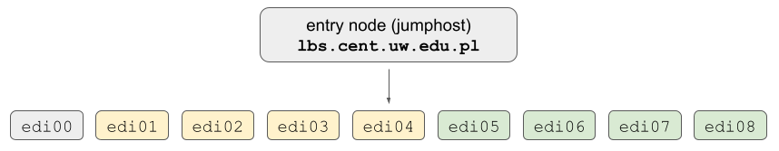

### **Setting up an account**
In order to create your an account on EDI cluster please reach out to Janek and / or Staszek via Slack.

**You will get a set of two credentials in different e-mail messages.**

- First password allows to login to the entry node (jumphost) at <code>lbs.cent.uw.edu.pl</code>. 
This password needs to be changed after first login and subsequently in 90 days intervals.
- Second password allows to login to the compute [nodes](resources.md) <code>edi0[0-8]</code>.

!!! Information
    **Please note that for now password changes on each of the compute nodes and the entry node are not
    synced.**
    
    The centralized authentication system will be introduced in near future.

### **Connecting via SSH**
Connections to the EDI cluster are handled via SSH protocol. See the figure below
for a brief introduction of the network organization:


In order to login to the entry node you can issue the following command:

```sh
ssh your_username@lbs.cent.uw.edu.pl
```
This will bring you to the **entry node (jumphost)**, afterwards you can connect to any of the **compute nodes** 
([click here](resources.md) for a complete list of available resources), for example:
```sh
ssh your_username@edi01
```

**In order to simplify file copying, every day work with e.g. Jupyter notebooks the suggested way of connecting
to individual <code>edi</code> nodes is to use [sshuttle](https://github.com/sshuttle/sshuttle). This allows to
bypass the login node and work almost the same way as being connected via VPN to the local network.**

!!! Example
    Assuming <code>sshuttle</code> was installed according to the [guide](https://sshuttle.readthedocs.io/en/stable/installation.html)
    you can connect as follows:
    ```sh
    sshuttle --dns -NHr your_username@lbs.cent.uw.edu.pl 10.10.61.1/24
    ```
    Once connection is established you can directly login to any <code>edi</code> node:
    ```sh
    ssh edi05
    ```

!!! Information
    During the first connection to the entry node you will be required to change the initially obtained password.
    
!!! Information
    Additionally, depending on your computer and network settings, you may have to connect to <code>edi</code> nodes 
    once without <code>sshuttle</code> so that SSH connections are properly configured.

To avoid putting password during each login you can set up authorization via a certificate - additional information
is available [here](certificates.md)

### **Work environment**
Each user has access to two personal directories:

- <code>/home/users/your_username</code>
- <code>/home/nfs/your_username</code>
!!! Warning
    **The contents of the default directory <code>/home/users/your_username</code> are unique to each compute node and 
    they are not available on other nodes.** 
    
    In order to use distributed file system please <code>/home/nfs/your_username</code> network mount 
    (please follow the [guidelines](faq.md#what-are-the-guidelines-for-homenfs-distributed-filesystem-use)).

### **Transferring files**
The recommended options to send or fetch files from EDI cluster are either <code>scp</code> or <code>rsync</code>.

The storage on the entry host <code>lbs.cent.uw.edu.pl</code> is **very** limited therefore it is recommended to setup
**sshuttle** to send / fetch files directly.

!!! Information
    Assuming you established a connection with <code>sshuttle</code> you can directly send files or
    directories to any <code>edi</code> node:
    ```sh
    scp file.txt your_username@edi05:
    ```

### **Next steps**
Once the basics are set up you should be able to start running calculations. Follow the next chapter for more details.